<div align="center">
  <h1>🏠 Organizing and Analyzing Airbnb Data - Rio de Janeiro</h1>
  <p><i>Complete data pipeline for cleaning, processing, and transforming Airbnb listings and reviews data</i></p>
</div>

<p align="center">
  <a href="#-overview">Overview</a> •
  <a href="#-objective">Objective</a> •
  <a href="#-technologies-used">Technologies</a> •
  <a href="#-project-structure">Project Structure</a> •
  <a href="#-data-pipeline">Data Pipeline</a> •
  <a href="#-implemented-features">Features</a> •
  <a href="#-results-and-insights">Results & Insights</a> •
  <a href="#-how-to-use">How to Use</a> •
  <a href="#-next-steps">Next Steps</a> •
  <a href="#-license">License</a>
</p>

---

## 🔍 Overview

This project implements a **complete data processing pipeline** for Airbnb data in Rio de Janeiro, Brazil. It combines data preparation, missing value treatment, outlier detection and removal, and categorical variable transformation to create a clean, analysis-ready dataset.

The project demonstrates essential **Data Science skills** including:
- Data cleaning and preprocessing
- Statistical analysis using IQR method
- Feature engineering and encoding
- Data quality assessment
- Professional documentation and visualization

---

## 🎯 Objective

The main goal is to prepare and organize Airbnb data through a systematic approach that ensures:

1. **Data Integration**: Merge listings and reviews datasets
2. **Data Quality**: Handle missing values appropriately
3. **Outlier Management**: Detect and remove extreme values using statistical methods
4. **Feature Transformation**: Convert categorical variables to numerical format
5. **Analysis-Ready Output**: Generate a clean dataset for further analysis and modeling

---

## 🛠️ Technologies Used

<div align="center">

| Technology | Purpose | Version |
|------------|---------|---------|
|  | Core programming language | 3.x |
|  | Data manipulation and analysis | 2.3.3 |
|  | Numerical operations | 2.3.3 |
|  | Static visualizations | 3.x |
|  | Statistical visualizations | 0.13.x |
|  | Interactive development environment | Latest |

</div>

---

## 📁 Project Structure

```
06_Organizing_and_Analyzing_Airbnb_Data/
└── Organizing_and_analyzing_Airbnb_data/
    ├── data/
    │   ├── listings_cleaned.csv          # Original listings dataset
    │   └── reviews.csv                   # Original reviews dataset
    │   
    ├── main.ipynb                        # Main project notebook
    ├── README.md                         # Project documentation
    └── LICENSE.md                        # License information
```

---

## 🔄 Data Pipeline

### 📊 Complete Processing Flow

```mermaid
graph TD
    A[📥 Listings Dataset<br/>39,499 records × 8 columns] --> B[🔧 Missing Values Treatment<br/>4 columns filled with median]
    B --> C[📊 Listings Complete<br/>39,499 records × 8 columns<br/>100% complete]
    D[📥 Reviews Dataset<br/>32,695 records × 3 columns<br/>No missing values] --> E[🔗 Data Merge<br/>Inner Join on 'id']
    C --> E
    E --> F[📊 Combined Dataset<br/>32,695 records × 10 columns]
    F --> G[🔍 Outlier Detection<br/>IQR Method on 6 variables]
    G --> H[✂️ Outlier Removal<br/>6,044 removed - 18.49%]
    H --> I[📊 Clean Dataset<br/>26,651 records × 10 columns]
    I --> J[🔄 Categorical Encoding<br/>2 variables transformed]
    J --> K[✅ Final Dataset<br/>26,651 rows × 12 columns<br/>81.51% retention rate]
```



### 📈 Data Transformation Summary

| Stage | Input | Output | Change | Details |
|-------|-------|--------|--------|---------|
| **1. Initial Load** | Raw files | 39,499 listings<br/>32,695 reviews | - | 2 separate datasets |
| **2. Missing Values** | 7.32% missing | 100% complete | +2,890 filled | Median imputation |
| **3. Data Merge** | 2 datasets | 32,695 records | -6,804 | Inner join on 'id' |
| **4. Outlier Detection** | 32,695 records | 6,044 outliers found | 18.49% | IQR method |
| **5. Outlier Removal** | 32,695 records | 26,651 records | -18.49% | Conservative approach |
| **6. Feature Engineering** | 10 columns | 12 columns | +2 features | Categorical encoding |
| **Final Dataset** | - | 26,651 × 12 | 81.51% retained | Analysis-ready |

---

## 📝 Implemented Features

### 1️⃣ **Data Preparation** (25 points)

<details>
<summary><b>📂 Click to expand details</b></summary>

#### Activities Performed:
- ✅ Import datasets using `pandas.read_csv()`
- ✅ Initial exploratory data analysis (EDA)
- ✅ Data type verification and structure analysis
- ✅ Dataset merge using `pd.merge()` with inner join **AFTER** missing value treatment

#### Input Datasets:

**listings_cleaned.csv** (39,499 × 8)
```python
Columns:
- id                      # int64    - Unique property identifier
- neighbourhood_cleansed  # object   - Property neighborhood
- room_type              # object   - Accommodation type
- accommodates           # int64    - Number of guests
- bathrooms              # float64  - Number of bathrooms (2,890 missing)
- bedrooms               # float64  - Number of bedrooms (523 missing)
- beds                   # float64  - Number of beds (2,869 missing)
- price                  # float64  - Daily rate in R$ (2,855 missing)
```

**reviews.csv** (32,695 × 3)
```python
Columns:
- id                      # int64    - Unique property identifier
- number_of_reviews       # int64    - Total reviews count
- review_scores_rating    # float64  - Average rating score
```

#### Merge Strategy:

```python
# Merge performed AFTER missing value treatment
df = pd.merge(listings_filled, reviews, on="id", how="inner")
```

#### Results:
- **Combined Dataset**: 32,695 records × 10 columns
- **Merge Type**: Inner join (only properties with reviews)
- **Data Loss**: 6,804 listings without reviews (17.2%)
- **Rationale**: Focus on properties with guest feedback for quality analysis

</details>

---

### 2️⃣ **Missing Values Treatment** (25 points)

<details>
<summary><b>🔧 Click to expand details</b></summary>

#### Missing Values Identified:

| Column | Missing Values | Percentage | Impact |
|--------|----------------|------------|--------|
| **bathrooms** | 2,890 | 7.32% | 🔴 High |
| **beds** | 2,869 | 7.26% | 🔴 High |
| **price** | 2,855 | 7.23% | 🔴 High |
| **bedrooms** | 523 | 1.32% | 🟡 Low |
| **TOTAL** | **9,137** | **~7.23%** | - |

#### Imputation Strategy:

**Method Used**: **Median Imputation**

**Rationale**:
- ✅ Robust to outliers (better than mean)
- ✅ Preserves data distribution
- ✅ Suitable for skewed distributions
- ✅ Appropriate for discrete values (beds, bedrooms, bathrooms)
- ✅ Better than mean for asymmetric price data

#### Imputation Values Applied:

```python
# Values used for filling missing data
bathrooms_median  = 1.0      # Typical 1-bathroom property
bedrooms_median   = 1.0      # Typical 1-bedroom property
beds_median       = 2.0      # Typical 2-bed configuration
price_median      = 671.00   # R$ 671.00 per night
```

#### Treatment Process:

```python
# Step-by-step imputation
listings_filled = listings.copy()

listings_filled["bathrooms"].fillna(bathrooms_median, inplace=True)
listings_filled["bedrooms"].fillna(bedrooms_median, inplace=True)
listings_filled["beds"].fillna(beds_median, inplace=True)
listings_filled["price"].fillna(price_median, inplace=True)
```

#### Verification:

```python
# Before treatment
Total Missing: 9,137 values (7.23% of dataset)

# After treatment
Total Missing: 0 values (0%)
```

#### Result:
✅ **100% of missing values successfully treated**
✅ **No data loss from missing values**
✅ **Distribution preserved**

</details>

---

### 3️⃣ **Outlier Detection and Removal** (25 points)

<details>
<summary><b>📊 Click to expand details</b></summary>

#### Method: IQR (Interquartile Range)

**Statistical Formula**:
```
Q1 = 25th percentile (first quartile)
Q3 = 75th percentile (third quartile)
IQR = Q3 - Q1 (interquartile range)

Lower Bound = Q1 - 1.5 × IQR
Upper Bound = Q3 + 1.5 × IQR

Outliers: values < Lower Bound OR values > Upper Bound
```

#### Outliers Detected by Variable:

| Variable | Lower Bound | Upper Bound | Outliers | Percentage | Interpretation |
|----------|-------------|-------------|----------|------------|----------------|
| **number_of_reviews** | -38.0 | 66.0 | 3,637 | 11.12% | 🔴 Exceptionally popular properties |
| **accommodates** | -1.0 | 7.0 | 1,356 | 4.15% | 🔴 Very large properties (>7 guests) |
| **price** | -552.5 | 1,931.5 | 923 | 2.82% | 🟡 Luxury or very cheap listings |
| **beds** | -2.0 | 6.0 | 501 | 1.53% | 🟢 Unusual bed configurations |
| **bedrooms** | -0.5 | 3.5 | 485 | 1.48% | 🟢 Properties with many bedrooms |
| **bathrooms** | -0.5 | 3.5 | 398 | 1.22% | 🟢 Properties with many bathrooms |

#### Outlier Analysis:

**🔴 High Impact Variables**:
- **number_of_reviews** (11.12%): Properties with exceptional review counts
  - Indicates very popular, long-established listings
  - May skew analysis of typical property performance
  
- **accommodates** (4.15%): Very large properties (>7 guests)
  - Event spaces, large villas, group accommodations
  - Different market segment from typical listings

**🟡 Medium Impact Variables**:
- **price** (2.82%): Extreme prices
  - Ultra-luxury penthouses (>R$ 1,931.50/night)
  - Suspiciously cheap listings (<R$ -552.50 - likely errors)

**🟢 Low Impact Variables**:
- **beds**, **bedrooms**, **bathrooms** (~1.5%): Unusual configurations
  - Large family properties
  - Commercial-style accommodations

#### Removal Process:

```python
# Sequential filtering approach
df_no_outliers = df.copy()

for col in ["accommodates", "bathrooms", "bedrooms", "beds", "price", "number_of_reviews"]:
    Q1 = df_no_outliers[col].quantile(0.25)
    Q3 = df_no_outliers[col].quantile(0.75)
    IQR = Q3 - Q1
    
    lower_bound = Q1 - 1.5 * IQR
    upper_bound = Q3 + 1.5 * IQR
    
    df_no_outliers = df_no_outliers[
        (df_no_outliers[col] >= lower_bound) & 
        (df_no_outliers[col] <= upper_bound)
    ]
```

#### Removal Results:

```python
📉 Original Records:     32,695
📉 After Removal:        26,651
🗑️  Outliers Removed:    6,044 (18.49%)
✅ Records Retained:     26,651 (81.51%)
```

#### Quality Metrics:

| Metric | Value | Status | Interpretation |
|--------|-------|--------|----------------|
| **Retention Rate** | 81.51% | ✅ Excellent | High data preservation |
| **Data Loss** | 18.49% | ✅ Acceptable | Conservative removal |
| **Method** | IQR | ✅ Robust | Industry standard |
| **Data Quality** | High | ✅ Improved | More realistic distribution |

#### Why This Approach?

✅ **Conservative**: 81.51% retention is excellent
✅ **Robust**: IQR method is less sensitive to extreme values than standard deviation
✅ **Interpretable**: Clear statistical justification for each removal
✅ **Reproducible**: Consistent methodology across all variables

</details>

---

### 4️⃣ **Categorical Variable Transformation** (25 points)

<details>
<summary><b>🔄 Click to expand details</b></summary>

#### Variables Transformed:

##### 1. **neighbourhood_cleansed** (Neighborhoods)

```python
Method: .astype("category").cat.codes
Original Type: object (string)
New Type: int64 (numeric codes)
Unique Categories: 163 neighborhoods
Encoding Range: 0 to 162
New Column: neighbourhood_code
```

**Encoding Process**:
```python
df_encoded["neighbourhood_code"] = df_encoded["neighbourhood_cleansed"].astype("category").cat.codes
```

**Mapping Example**:
```python
# Sample mapping (alphabetically ordered)
0  → "Abolição"
1  → "Acari"
2  → "Alto da Boa Vista"
...
42 → "Copacabana"
...
162 → "Vargem Grande"
```

**Top 10 Neighborhoods** (by property count - estimated):
```
1. Copacabana           - Beach area, tourist hotspot
2. Ipanema              - Upscale beach neighborhood
3. Barra da Tijuca      - Modern, large properties
4. Leblon               - Luxury beach area
5. Botafogo             - Residential, near beach
6. Tijuca               - Central, residential
7. Flamengo             - Traditional neighborhood
8. Centro               - Business district
9. Santa Teresa         - Historic, bohemian
10. Recreio dos Bandeirantes - Far west beaches
```

##### 2. **room_type** (Accommodation Type)

```python
Method: .astype("category").cat.codes
Original Type: object (string)
New Type: int64 (numeric codes)
Unique Categories: 4 types
Encoding Range: 0 to 3
New Column: room_type_code
```

**Encoding Process**:
```python
df_encoded["room_type_code"] = df_encoded["room_type"].astype("category").cat.codes
```

**Complete Mapping**:
```python
Code Mapping (alphabetically ordered):
0 → "Entire home/apt"    # Whole property rental
1 → "Hotel room"         # Hotel-style room
2 → "Private room"       # Private room in shared space
3 → "Shared room"        # Shared dormitory-style
```

**Distribution** (estimated):
```
Entire home/apt  ████████████████████████████ 67% (~17,856 properties)
Private room     ██████████ 26% (~6,929 properties)
Shared room      ██ 5% (~1,333 properties)
Hotel room       █ 2% (~533 properties)
```

#### Transformation Summary:

```python
Original Dataset:
- 10 columns (8 numeric, 2 categorical)
- Categorical variables as strings

After Transformation:
- 12 columns (10 numeric, 2 categorical + 2 encoded)
- All variables ML-ready
- Original columns preserved for interpretability
```

#### New Features Created:

| Original Column | New Column | Type | Range | Purpose |
|----------------|------------|------|-------|---------|
| neighbourhood_cleansed | neighbourhood_code | int64 | 0-162 | ML models, clustering |
| room_type | room_type_code | int64 | 0-3 | Classification, regression |

#### Encoding Benefits:

✅ **Machine Learning Compatibility**:
- Algorithms require numerical input
- Enables distance calculations
- Supports regression and classification

✅ **Memory Efficiency**:
- int64 (8 bytes) vs string (variable)
- Faster computation
- Reduced memory footprint

✅ **Computational Speed**:
- Numeric operations are faster
- Efficient sorting and grouping
- Better indexing performance

✅ **Maintained Interpretability**:
- Original columns preserved
- Mapping dictionary available
- Easy to reverse encoding

#### Usage Example:

```python
# Original categorical data
df_encoded["neighbourhood_cleansed"]  # "Copacabana"
df_encoded["room_type"]              # "Entire home/apt"

# Encoded numerical data
df_encoded["neighbourhood_code"]      # 42
df_encoded["room_type_code"]         # 0

# Reverse mapping
neighbourhood_mapping = dict(enumerate(df_encoded["neighbourhood_cleansed"].astype("category").cat.categories))
neighbourhood_mapping[42]  # Returns: "Copacabana"
```

</details>

---

## 📈 Results and Insights

### 🎯 Quality Metrics

<div align="center">

| Metric | Value | Status |
|--------|-------|--------|
| **Initial Records (Listings)** | 39,499 | 📥 |
| **Initial Records (Reviews)** | 32,695 | 📥 |
| **Missing Values Treated** | 9,137 (100%) | ✅ |
| **Records After Merge** | 32,695 | 🔗 |
| **Outliers Detected** | 6,044 | 🔍 |
| **Outliers Removed** | 6,044 (18.49%) | ✂️ |
| **Final Records** | 26,651 | 📊 |
| **Retention Rate** | 81.51% | ⭐ |
| **Categorical Variables Encoded** | 2 | 🔄 |
| **Final Columns** | 12 | 📋 |
| **Data Completeness** | 100% | ✅ |
| **Data Quality** | High | ⭐ |

</div>

### 💡 Key Insights

<details>
<summary><b>📍 Geographic Distribution</b></summary>

#### Neighborhood Analysis:

- **163 neighborhoods** represented across Rio de Janeiro
- **Geographic diversity** maintained after cleaning (81.51% retention)
- **Top tourist zones** dominate the dataset:
  - Copacabana, Ipanema, Leblon (beach areas)
  - Barra da Tijuca (modern development)
  - Santa Teresa (historic charm)

#### Market Concentration:

```
High Density Areas (Tourist Zones):
- South Zone beaches: 40-50% of listings
- Barra da Tijuca: 15-20% of listings
- Downtown/Centro: 10-15% of listings
- Other neighborhoods: 15-25% of listings
```

#### Insight:
✅ Strong concentration in traditional tourist areas
✅ Diverse geographic coverage preserved
✅ Represents full spectrum of Rio's accommodation market

</details>

<details>
<summary><b>🏠 Accommodation Types</b></summary>

#### Distribution Analysis:

```python
Entire home/apt:  67% (~17,856 properties)
- Full property rental
- Most popular choice
- Higher price point

Private room:     26% (~6,929 properties)
- Private room in shared space
- Budget-friendly option
- Social experience

Shared room:      5% (~1,333 properties)
- Dormitory-style
- Lowest price point
- Backpacker market

Hotel room:       2% (~533 properties)
- Professional hospitality
- Hotel-like amenities
- Consistent quality
```

#### Market Insights:

**Guest Preferences**:
- **Privacy is king**: 67% want entire property
- **Budget travelers**: 26% accept shared spaces for lower prices
- **Niche markets**: Hostels (5%) and hotels (2%) are minority

**Host Strategy**:
- Entire homes command premium prices
- Private rooms balance income and property use
- Shared rooms maximize occupancy in high-demand areas

#### Insight:
✅ Guests strongly prefer privacy and full property access
✅ Private rooms offer good middle-ground option
✅ Shared accommodations serve budget-conscious travelers

</details>

<details>
<summary><b>💰 Price Analysis</b></summary>

#### Price Statistics:

```python
Original Price Distribution (with outliers):
- Median: R$ 671.00
- Range: R$ 0 to R$ 50,000+ (unrealistic extremes)
- Mean: Heavily skewed by outliers

After Outlier Removal:
- Valid Range: R$ -552.50 to R$ 1,931.50
- More realistic pricing distribution
- Better representation of typical market
- Median: ~R$ 671.00 (preserved)
```

#### Price Insights:

**Outliers Removed** (923 properties - 2.82%):
- Ultra-luxury listings (>R$ 1,931.50/night)
- Suspicious/error prices (<R$ 0)
- Commercial event spaces
- Unrealistic pricing

**Typical Price Ranges** (estimated):
```
Budget:       R$ 100 - R$ 300   (Shared rooms, far locations)
Mid-Range:    R$ 300 - R$ 800   (Private rooms, good locations)
Premium:      R$ 800 - R$ 1,500 (Entire homes, prime areas)
Luxury:       R$ 1,500 - R$ 1,931 (High-end properties)
```

#### Insight:
✅ Outlier removal created realistic price range
✅ Median (R$ 671) represents typical mid-range property
✅ Dataset now suitable for price prediction models

</details>

<details>
<summary><b>⭐ Reviews and Ratings</b></summary>

#### Review Statistics:

```python
Number of Reviews:
- Outliers detected: 3,637 properties (11.12%)
- Threshold: >66 reviews
- Indicates long-established, popular listings

Review Scores:
- Generally high ratings (quality platform)
- Consistent guest satisfaction
- No missing values in reviews dataset
```

#### Review Insights:

**High Review Count Properties** (outliers):
- Established hosts with proven track record
- Popular locations (tourist hotspots)
- Competitive pricing strategies
- Excellent guest service

**Review Score Patterns**:
- High average ratings across platform
- Quality control through guest feedback
- Hosts incentivized to maintain standards

#### Insight:
✅ Platform has strong base of well-reviewed properties
✅ High review counts indicate market leaders
✅ Review system effectively maintains quality standards

</details>

<details>
<summary><b>🔍 Data Quality Assessment</b></summary>

#### Quality Strengths:

✅ **High Retention Rate** (81.51%):
- Conservative outlier removal
- Preserved data diversity
- Maintained statistical power

✅ **Complete Data** (100%):
- All missing values treated
- No gaps in final dataset
- Ready for analysis

✅ **Appropriate Methods**:
- Median imputation for skewed data
- IQR method for outlier detection
- Categorical encoding for ML compatibility

✅ **Maintained Interpretability**:
- Original columns preserved
- Clear mapping for encoded variables
- Documented transformation process

#### Improvements Made:

**Before Cleaning**:
- 7.23% missing values
- Extreme outliers distorting analysis
- Categorical variables as strings
- Unrealistic price ranges

**After Cleaning**:
- 0% missing values
- Realistic value ranges
- ML-ready numerical features
- High-quality, analysis-ready dataset

#### Data Quality Score:

| Aspect | Score | Status |
|--------|-------|--------|
| **Completeness** | 100% | ✅ Excellent |
| **Accuracy** | High | ✅ Outliers removed |
| **Consistency** | High | ✅ Standardized |
| **Validity** | High | ✅ Realistic ranges |
| **Timeliness** | Current | ✅ 2024 data |

#### Insight:
✅ Dataset meets professional data science standards
✅ Suitable for advanced analytics and modeling
✅ Well-documented and reproducible process

</details>

### 📊 Final Dataset Characteristics

```python
Dataset: airbnb_data_cleaned_final.csv

Dimensions: 26,651 rows × 12 columns

Columns:
├── id                      (int64)    # Unique property identifier
├── neighbourhood_cleansed  (object)   # Neighborhood name (original)
├── neighbourhood_code      (int64)    # Neighborhood numeric code (0-162)
├── room_type              (object)   # Accommodation type (original)
├── room_type_code         (int64)    # Room type numeric code (0-3)
├── accommodates           (int64)    # Guest capacity (1-7)
├── bathrooms              (float64)  # Number of bathrooms (0.5-3.5)
├── bedrooms               (float64)  # Number of bedrooms (0.5-3.5)
├── beds                   (float64)  # Number of beds (0-6)
├── price                  (float64)  # Daily rate in R$ (-552.5 to 1,931.5)
├── number_of_reviews      (int64)    # Review count (0-66)
└── review_scores_rating   (float64)  # Average rating (1.0-5.0)

File Size: ~2.44 MB
Memory Usage: ~2.5 MB
Data Quality: High
Completeness: 100%
Ready for: Analysis, Modeling, Visualization, Dashboard
```

---

## 🚀 How to Use

### Prerequisites

```bash
# Required Python version
Python 3.8+

# Required libraries (exact versions from notebook)
pandas==2.3.3
numpy==2.3.3
matplotlib>=3.4.0
seaborn>=0.11.0
jupyter>=1.0.0
```

### Installation

1. **Clone the repository**:
```bash
git clone https://github.com/your-username/airbnb-rio-analysis.git
cd airbnb-rio-analysis/Organizing_and_analyzing_Airbnb_data
```

2. **Create virtual environment** (recommended):
```bash
# Windows
python -m venv venv
venv\Scripts\activate

# Linux/Mac
python3 -m venv venv
source venv/bin/activate
```

3. **Install dependencies**:
```bash
# Option 1: Install specific versions
pip install pandas==2.3.3 numpy==2.3.3 matplotlib seaborn jupyter

# Option 2: Install from requirements.txt (if available)
pip install -r requirements.txt
```

### Running the Project

1. **Start Jupyter Notebook**:
```bash
jupyter notebook
```

2. **Open the main notebook**:
```
Navigate to: main.ipynb
```

3. **Run all cells**:
```
Menu: Cell → Run All
or
Keyboard: Shift + Enter (cell by cell)
```

4. **Expected execution time**:
```
Total runtime: ~2-3 minutes
- Data loading: ~10 seconds
- Missing values: ~5 seconds
- Outlier detection: ~30 seconds
- Encoding: ~10 seconds
- Visualizations: ~60 seconds
```

### Using the Cleaned Dataset

```python
import pandas as pd
import numpy as np

# Load the final cleaned dataset
df = pd.read_csv("data/airbnb_data_cleaned_final.csv")

# Quick exploration
print("Dataset Shape:", df.shape)
print("\nColumn Types:")
print(df.dtypes)
print("\nFirst 5 rows:")
print(df.head())

# Statistical summary
print("\nStatistical Summary:")
print(df.describe())

# Example 1: Analyze prices by neighborhood (top 10)
price_by_neighborhood = df.groupby("neighbourhood_cleansed")["price"].agg([
    ("mean_price", "mean"),
    ("median_price", "median"),
    ("count", "count")
]).sort_values("mean_price", ascending=False).head(10)

print("\nTop 10 Most Expensive Neighborhoods:")
print(price_by_neighborhood)

# Example 2: Analyze room types
room_type_stats = df.groupby("room_type").agg({
    "price": ["mean", "median", "count"],
    "review_scores_rating": "mean",
    "number_of_reviews": "mean"
})

print("\nRoom Type Analysis:")
print(room_type_stats)

# Example 3: Correlation analysis
numeric_cols = ["accommodates", "bathrooms", "bedrooms", "beds", 
                "price", "number_of_reviews", "review_scores_rating"]
correlation_matrix = df[numeric_cols].corr()

print("\nCorrelation Matrix:")
print(correlation_matrix)

# Example 4: Filter properties
# Find affordable entire homes in Copacabana
copacabana_homes = df[
    (df["neighbourhood_cleansed"] == "Copacabana") &
    (df["room_type"] == "Entire home/apt") &
    (df["price"] <= 800)
].sort_values("review_scores_rating", ascending=False)

print(f"\nAffordable Entire Homes in Copacabana: {len(copacabana_homes)} properties")
print(copacabana_homes[["price", "bedrooms", "review_scores_rating"]].head())
```

---

## 🎯 Next Steps

### 📊 Recommended Analyses

<details>
<summary><b>1. Advanced Exploratory Data Analysis (EDA)</b></summary>

```python
Suggested Analyses:

1. Correlation Heatmap:
   - Visualize relationships between numerical variables
   - Identify strong predictors of price
   - Detect multicollinearity

2. Price Distribution by Neighborhood:
   - Box plots for top 10 neighborhoods
   - Violin plots showing distribution shapes
   - Statistical tests (ANOVA) for significance

3. Reviews vs Ratings Analysis:
   - Scatter plot: number_of_reviews vs review_scores_rating
   - Identify optimal review count for credibility
   - Analyze rating patterns

4. Accommodation Capacity Analysis:
   - Price vs accommodates relationship
   - Optimal property size for ROI
   - Market segmentation by capacity

5. Geographic Analysis:
   - Map visualizations (if coordinates available)
   - Neighborhood clustering by characteristics
   - Distance to tourist attractions impact

Code Example:
```python
import seaborn as sns
import matplotlib.pyplot as plt

# Correlation heatmap
plt.figure(figsize=(10, 8))
sns.heatmap(df[numeric_cols].corr(), annot=True, cmap="coolwarm", center=0)
plt.title("Correlation Heatmap - Airbnb Features")
plt.show()

# Price by neighborhood (top 10)
top_neighborhoods = df.groupby("neighbourhood_cleansed")["price"].mean().nlargest(10)
plt.figure(figsize=(12, 6))
top_neighborhoods.plot(kind="barh")
plt.xlabel("Average Price (R$)")
plt.title("Top 10 Most Expensive Neighborhoods")
plt.show()
```
```

</details>

<details>
<summary><b>2. Statistical Analysis</b></summary>

```python
Statistical Tests to Implement:

1. ANOVA (Analysis of Variance):
   - Test: Do prices differ significantly across neighborhoods?
   - Null Hypothesis: All neighborhoods have equal mean prices
   - Alternative: At least one neighborhood differs

2. T-Test:
   - Compare: Entire home/apt vs Private room prices
   - Test: Is the price difference statistically significant?

3. Chi-Square Test:
   - Test: Independence between room_type and neighborhood
   - Question: Are certain room types more common in specific areas?

4. Linear Regression:
   - Dependent: price
   - Independent: accommodates, bedrooms, bathrooms, review_scores_rating
   - Goal: Identify key price drivers

5. Correlation Tests:
   - Pearson: Linear relationships
   - Spearman: Monotonic relationships
   - Significance testing

Code Example:
```python
from scipy import stats

# ANOVA: Price differences across top 5 neighborhoods
top_5_neighborhoods = df["neighbourhood_cleansed"].value_counts().head(5).index
groups = [df[df["neighbourhood_cleansed"] == n]["price"] for n in top_5_neighborhoods]
f_stat, p_value = stats.f_oneway(*groups)

print(f"ANOVA Results:")
print(f"F-statistic: {f_stat:.4f}")
print(f"P-value: {p_value:.4f}")
print(f"Significant: {'Yes' if p_value < 0.05 else 'No'}")

# T-Test: Entire home vs Private room
entire_homes = df[df["room_type"] == "Entire home/apt"]["price"]
private_rooms = df[df["room_type"] == "Private room"]["price"]
t_stat, p_value = stats.ttest_ind(entire_homes, private_rooms)

print(f"\nT-Test Results:")
print(f"T-statistic: {t_stat:.4f}")
print(f"P-value: {p_value:.4f}")
print(f"Mean difference: R$ {entire_homes.mean() - private_rooms.mean():.2f}")
```
```

</details>

<details>
<summary><b>3. Machine Learning Models</b></summary>

**Regression Models** (Price Prediction):
```python
Objective: Predict property prices based on features

Models to Implement:
1. Linear Regression (baseline)
   - Simple, interpretable
   - Establishes baseline performance
   
2. Random Forest Regressor
   - Handles non-linear relationships
   - Feature importance analysis
   
3. XGBoost Regressor
   - State-of-the-art performance
   - Robust to outliers
   
4. Neural Networks (MLP)
   - Complex pattern recognition
   - High capacity model

Features:
- neighbourhood_code (163 categories)
- room_type_code (4 categories)
- accommodates
- bathrooms
- bedrooms
- beds
- number_of_reviews
- review_scores_rating

Target:
- price (R$ per night)

Evaluation Metrics:
- MAE (Mean Absolute Error)
- RMSE (Root Mean Squared Error)
- R² Score
- MAPE (Mean Absolute Percentage Error)

Code Example:
```python
from sklearn.model_selection import train_test_split
from sklearn.ensemble import RandomForestRegressor
from sklearn.metrics import mean_absolute_error, r2_score

# Prepare features and target
features = ["neighbourhood_code", "room_type_code", "accommodates", 
            "bathrooms", "bedrooms", "beds", "number_of_reviews", 
            "review_scores_rating"]
X = df[features]
y = df["price"]

# Split data
X_train, X_test, y_train, y_test = train_test_split(X, y, test_size=0.2, random_state=42)

# Train model
model = RandomForestRegressor(n_estimators=100, random_state=42)
model.fit(X_train, y_train)

# Evaluate
y_pred = model.predict(X_test)
mae = mean_absolute_error(y_test, y_pred)
r2 = r2_score(y_test, y_pred)

print(f"Model Performance:")
print(f"MAE: R$ {mae:.2f}")
print(f"R² Score: {r2:.4f}")

# Feature importance
feature_importance = pd.DataFrame({
    "feature": features,
    "importance": model.feature_importances_
}).sort_values("importance", ascending=False)

print("\nFeature Importance:")
print(feature_importance)
```
```

**Classification Models** (Room Type Prediction):
```python
Objective: Predict room_type based on property characteristics

Models to Implement:
1. Logistic Regression (baseline)
2. Decision Trees
3. Random Forest Classifier
4. Support Vector Machines (SVM)
5. Gradient Boosting (XGBoost)

Features:
- neighbourhood_code
- accommodates
- bathrooms
- bedrooms
- beds
- price
- number_of_reviews
- review_scores_rating

Target:
- room_type_code (0-3)

Evaluation Metrics:
- Accuracy
- Precision, Recall, F1-Score
- Confusion Matrix
- ROC-AUC Score
```

**Clustering** (Neighborhood Segmentation):
```python
Objective: Group similar neighborhoods by characteristics

Algorithms:
1. K-Means Clustering
   - Partition neighborhoods into k groups
   - Identify market segments
   
2. DBSCAN
   - Density-based clustering
   - Identify outlier neighborhoods
   
3. Hierarchical Clustering
   - Dendrogram visualization
   - Understand neighborhood relationships

Features for Clustering:
- Average price per neighborhood
- Average rating per neighborhood
- Property count per neighborhood
- Room type distribution
- Average accommodates

Purpose:
- Market segmentation
- Competitive analysis
- Investment opportunity identification
- Pricing strategy development

Code Example:
```python
from sklearn.cluster import KMeans
from sklearn.preprocessing import StandardScaler

# Aggregate by neighborhood
neighborhood_stats = df.groupby("neighbourhood_cleansed").agg({
    "price": "mean",
    "review_scores_rating": "mean",
    "accommodates": "mean",
    "id": "count"
}).rename(columns={"id": "property_count"})

# Standardize features
scaler = StandardScaler()
X_scaled = scaler.fit_transform(neighborhood_stats)

# K-Means clustering
kmeans = KMeans(n_clusters=5, random_state=42)
neighborhood_stats["cluster"] = kmeans.fit_predict(X_scaled)

print("Neighborhood Clusters:")
print(neighborhood_stats.groupby("cluster").mean())
```
```

</details>

<details>
<summary><b>4. Interactive Dashboard</b></summary>

**Technologies**:
- **Plotly Dash**: Python-based interactive dashboards
- **Streamlit**: Rapid prototyping, easy deployment
- **Power BI / Tableau**: Business intelligence tools

**Dashboard Features**:

```python
1. Filters Panel:
   - Neighborhood selector (multi-select)
   - Price range slider
   - Room type checkboxes
   - Accommodation capacity filter
   - Rating threshold

2. KPI Cards:
   - Total Listings
   - Average Price
   - Average Rating
   - Total Reviews
   - Occupancy Rate (if available)

3. Visualizations:
   - Interactive map (geographic distribution)
   - Price heatmap by neighborhood
   - Time series (if date data available)
   - Room type distribution (pie chart)
   - Price vs Rating scatter plot

4. Comparison Tools:
   - Neighborhood benchmarking
   - Property comparison table
   - Market trends analysis

5. Insights Panel:
   - Top performers
   - Market opportunities
   - Pricing recommendations
   - Competitive analysis

Code Example (Streamlit):
```python
import streamlit as st
import plotly.express as px

st.title("🏠 Airbnb Rio de Janeiro - Interactive Dashboard")

# Sidebar filters
st.sidebar.header("Filters")
selected_neighborhoods = st.sidebar.multiselect(
    "Select Neighborhoods",
    options=df["neighbourhood_cleansed"].unique()
)

price_range = st.sidebar.slider(
    "Price Range (R$)",
    min_value=int(df["price"].min()),
    max_value=int(df["price"].max()),
    value=(int(df["price"].min()), int(df["price"].max()))
)

# Filter data
filtered_df = df[
    (df["neighbourhood_cleansed"].isin(selected_neighborhoods) if selected_neighborhoods else True) &
    (df["price"].between(price_range[0], price_range[1]))
]

# KPIs
col1, col2, col3, col4 = st.columns(4)
col1.metric("Total Listings", len(filtered_df))
col2.metric("Avg Price", f"R$ {filtered_df['price'].mean():.2f}")
col3.metric("Avg Rating", f"{filtered_df['review_scores_rating'].mean():.2f}")
col4.metric("Total Reviews", f"{filtered_df['number_of_reviews'].sum():,}")

# Visualizations
st.subheader("Price Distribution by Neighborhood")
fig = px.box(filtered_df, x="neighbourhood_cleansed", y="price")
st.plotly_chart(fig)

st.subheader("Room Type Distribution")
fig = px.pie(filtered_df, names="room_type")
st.plotly_chart(fig)
```
```

</details>

<details>
<summary><b>5. Business Intelligence</b></summary>

**Analysis Goals**:

```python
Business Questions to Answer:

1. Investment Analysis:
   Q: Which neighborhoods offer best ROI for hosts?
   Metrics: Price/sqm, occupancy rate, competition level
   Output: Investment recommendation matrix

2. Pricing Strategy:
   Q: What factors most influence pricing?
   Analysis: Regression analysis, feature importance
   Output: Dynamic pricing recommendations

3. Guest Behavior:
   Q: How do reviews impact booking rates?
   Analysis: Correlation, sentiment analysis
   Output: Review management strategy

4. Market Positioning:
   Q: Optimal pricing strategies by area?
   Analysis: Competitive analysis, price elasticity
   Output: Neighborhood-specific pricing guide

5. Market Saturation:
   Q: Which areas are oversaturated/undersaturated?
   Analysis: Supply-demand analysis, growth trends
   Output: Market opportunity map

6. Competitive Intelligence:
   Q: How to position new listings?
   Analysis: Benchmarking, gap analysis
   Output: Competitive positioning recommendations

Code Example:
```python
# ROI Analysis by Neighborhood
roi_analysis = df.groupby("neighbourhood_cleansed").agg({
    "price": ["mean", "median", "std"],
    "review_scores_rating": "mean",
    "number_of_reviews": "mean",
    "id": "count"
}).round(2)

roi_analysis.columns = ["avg_price", "median_price", "price_volatility", 
                        "avg_rating", "avg_reviews", "property_count"]

# Calculate opportunity score
roi_analysis["opportunity_score"] = (
    roi_analysis["avg_price"] * 0.4 +
    roi_analysis["avg_rating"] * 200 * 0.3 +
    roi_analysis["avg_reviews"] * 10 * 0.3
) / roi_analysis["property_count"]

print("Top 10 Investment Opportunities:")
print(roi_analysis.nlargest(10, "opportunity_score"))
```
```

</details>

<details>
<summary><b>6. Natural Language Processing (NLP)</b></summary>

**If review text data available**:

```python
NLP Tasks:

1. Sentiment Analysis:
   - Classify reviews as positive/negative/neutral
   - Identify satisfaction drivers
   - Track sentiment trends over time

2. Topic Modeling:
   - Discover common themes in reviews
   - LDA (Latent Dirichlet Allocation)
   - Identify what guests talk about most

3. Review Summarization:
   - Automatic summary generation
   - Extract key points from reviews
   - Highlight pros and cons

4. Keyword Extraction:
   - TF-IDF analysis
   - Most mentioned features
   - Competitive advantages identification

5. Rating Prediction from Text:
   - Predict rating from review text
   - Identify language patterns of satisfaction
   - Early warning system for issues

6. Aspect-Based Sentiment:
   - Sentiment by aspect (cleanliness, location, etc.)
   - Granular feedback analysis
   - Targeted improvement recommendations

Code Example (if text data available):
```python
from sklearn.feature_extraction.text import TfidfVectorizer
from textblob import TextBlob

# Sentiment analysis (example)
def analyze_sentiment(text):
    blob = TextBlob(text)
    return blob.sentiment.polarity

# Apply to reviews
df["sentiment_score"] = df["review_text"].apply(analyze_sentiment)
df["sentiment_category"] = df["sentiment_score"].apply(
    lambda x: "Positive" if x > 0.1 else ("Negative" if x < -0.1 else "Neutral")
)

print("Sentiment Distribution:")
print(df["sentiment_category"].value_counts())

# TF-IDF for keyword extraction
vectorizer = TfidfVectorizer(max_features=20, stop_words="english")
tfidf_matrix = vectorizer.fit_transform(df["review_text"])

print("\nTop Keywords:")
print(vectorizer.get_feature_names_out())
```
```

</details>

---

## 🤝 Contributing

Contributions are welcome! Here's how you can help:

### How to Contribute

1. **Fork the repository**
2. **Create a feature branch**:
   ```bash
   git checkout -b feature/AmazingFeature
   ```
3. **Commit your changes**:
   ```bash
   git commit -m "Add some AmazingFeature"
   ```
4. **Push to the branch**:
   ```bash
   git push origin feature/AmazingFeature
   ```
5. **Open a Pull Request**

### Contribution Ideas

- 🐛 **Bug fixes**: Identify and fix errors in data processing
- 📊 **Visualizations**: Add new charts and graphs
- 🤖 **ML Models**: Implement predictive models
- 📝 **Documentation**: Improve README and code comments
- 🌐 **Translation**: Translate documentation to other languages
- ⚡ **Performance**: Optimize code for faster execution
- 🧪 **Testing**: Add unit tests and validation
- 🎨 **Dashboard**: Create interactive visualizations
- 📈 **Analysis**: Add new statistical analyses
- 🔧 **Features**: Implement new data processing techniques

### Code Style Guidelines

```python
# Follow PEP 8 style guide
# Use descriptive variable names
# Add comments for complex logic
# Include docstrings for functions

def example_function(param1, param2):
    """
    Brief description of function.
    
    Parameters:
    -----------
    param1 : type
        Description of param1
    param2 : type
        Description of param2
        
    Returns:
    --------
    type
        Description of return value
    """
    # Implementation
    pass
```

---

## 📄 License

This project is licensed under the **Creative Commons Attribution-NonCommercial-NoDerivatives 4.0 International License (CC BY-NC-ND 4.0)**.

### You are free to:

- ✅ **Share**: Copy and redistribute the material in any medium or format

### Under the following terms:

- **Attribution** (BY): You must give appropriate credit, provide a link to the license, and indicate if changes were made. You may do so in any reasonable manner, but not in any way that suggests the licensor endorses you or your use.

- **NonCommercial** (NC): You may not use the material for commercial purposes.

- **NoDerivatives** (ND): If you remix, transform, or build upon the material, you may not distribute the modified material.

### What this means:

✅ **Allowed**:
- Use for educational purposes
- Use for personal learning
- Share with attribution
- Include in academic work (with citation)

❌ **Not Allowed**:
- Commercial use
- Selling or monetizing
- Creating derivative works for distribution
- Using in commercial products/services

For more details, see the [LICENSE.md](LICENSE.md) file or visit [Creative Commons](https://creativecommons.org/licenses/by-nc-nd/4.0/).

---

## 👤 Author

**Bianca Lorenzo**

- 📧 Email: [your-email@example.com](mailto:your-email@example.com)
- 💼 LinkedIn: [linkedin.com/in/your-profile](https://linkedin.com/in/your-profile)
- 🐙 GitHub: [@your-username](https://github.com/your-username)
- 📊 Portfolio: [your-portfolio.com](https://your-portfolio.com)

---

## 🙏 Acknowledgments

- **DNC School**: For providing the educational framework and project structure
- **Inside Airbnb**: For making the data publicly available
- **Open Source Community**: For the amazing tools and libraries (Pandas, NumPy, Matplotlib, Seaborn)
- **Data Science Community**: For continuous learning, inspiration, and best practices
- **Rio de Janeiro Hosts**: For contributing data that makes this analysis possible

---

## 📚 References

### Datasets
- **Inside Airbnb**: [http://insideairbnb.com/](http://insideairbnb.com/)
  - Rio de Janeiro listings and reviews data (2024)
  - Community-driven project providing data about Airbnb's impact on residential communities

### Methodologies
- **IQR Method**: Tukey, J. W. (1977). *Exploratory Data Analysis*. Addison-Wesley.
- **Missing Data Imputation**: Little, R. J., & Rubin, D. B. (2019). *Statistical Analysis with Missing Data* (3rd ed.). Wiley.
- **Feature Engineering**: Zheng, A., & Casari, A. (2018). *Feature Engineering for Machine Learning*. O'Reilly Media.
- **Data Cleaning**: Wickham, H. (2014). Tidy Data. *Journal of Statistical Software*, 59(10), 1-23.

### Tools Documentation
- **Pandas**: [https://pandas.pydata.org/docs/](https://pandas.pydata.org/docs/)
- **NumPy**: [https://numpy.org/doc/](https://numpy.org/doc/)
- **Matplotlib**: [https://matplotlib.org/stable/contents.html](https://matplotlib.org/stable/contents.html)
- **Seaborn**: [https://seaborn.pydata.org/](https://seaborn.pydata.org/)
- **Jupyter**: [https://jupyter.org/documentation](https://jupyter.org/documentation)

### Additional Reading
- **Data Science Best Practices**: [https://www.datascience.com/blog/data-science-best-practices](https://www.datascience.com/blog/data-science-best-practices)
- **Outlier Detection Methods**: Aggarwal, C. C. (2017). *Outlier Analysis* (2nd ed.). Springer.
- **Categorical Encoding**: Hancock, J. T., & Khoshgoftaar, T. M. (2020). Survey on categorical data for neural networks. *Journal of Big Data*, 7(1), 1-41.

---

## 📊 Project Statistics

<div align="center">


### Project Metrics

| Metric | Value |
|--------|-------|
| **Lines of Code** | ~500+ |
| **Data Processed** | 39,499 records |
| **Final Dataset** | 26,651 records |
| **Processing Steps** | 6 major stages |
| **Visualizations** | 10+ charts |
| **Documentation** | Comprehensive |
| **Reproducibility** | 100% |

</div>

---

## 🔖 Version History

### v1.0.0 (December 2024)
- ✅ Initial release
- ✅ Complete data pipeline implementation
- ✅ Missing value treatment (median imputation)
- ✅ Outlier detection and removal (IQR method)
- ✅ Categorical variable encoding
- ✅ Comprehensive documentation
- ✅ Visualization suite
- ✅ Analysis-ready dataset export

### Future Versions (Planned)
- 📊 v1.1.0: Interactive dashboard (Plotly Dash/Streamlit)
- 🤖 v1.2.0: Machine learning models (price prediction)
- 🗺️ v1.3.0: Geographic analysis with maps
- 📈 v1.4.0: Time series analysis (if temporal data available)
- 🌐 v1.5.0: Multi-language support

---

## 💬 FAQ

<details>
<summary><b>Q: Why was median used instead of mean for imputation?</b></summary>

**A**: Median is more robust to outliers and better preserves the distribution of skewed data. Since our data contains outliers (before removal) and price/accommodation features are typically skewed, median imputation is the appropriate choice.

</details>

<details>
<summary><b>Q: Why remove 18.49% of data as outliers?</b></summary>

**A**: The 18.49% removal rate is actually conservative. These outliers represent:
- Extreme luxury properties (>R$ 1,931.50/night)
- Data errors (negative prices, unrealistic configurations)
- Commercial properties (event spaces, not typical rentals)
- Properties with exceptional review counts (>66 reviews)

Removing them creates a more representative dataset of typical Airbnb properties, improving analysis quality.

</details>

<details>
<summary><b>Q: Can I use this code for other cities?</b></summary>

**A**: Yes! The code is designed to be adaptable. Simply:
1. Replace the data files with your city's data
2. Ensure column names match (or update them in the code)
3. Run the notebook
4. Adjust outlier thresholds if needed for your market

</details>

<details>
<summary><b>Q: How do I interpret the encoded categorical variables?</b></summary>

**A**: The encoding creates numerical codes (0, 1, 2, ...) for categorical variables:
- **neighbourhood_code**: 0-162 (alphabetically ordered neighborhoods)
- **room_type_code**: 0-3 (alphabetically ordered room types)

The original columns are preserved for interpretability. Use the mapping dictionaries to convert codes back to original values.

</details>

<details>
<summary><b>Q: Is this dataset suitable for machine learning?</b></summary>

**A**: Yes! The final dataset is ML-ready:
- ✅ No missing values (100% complete)
- ✅ Outliers removed (realistic value ranges)
- ✅ Categorical variables encoded
- ✅ Consistent data types
- ✅ High quality (81.51% retention)

You can directly use it for regression, classification, or clustering tasks.

</details>

<details>
<summary><b>Q: What's the difference between the original and encoded columns?</b></summary>

**A**: 
- **Original columns** (e.g., `neighbourhood_cleansed`, `room_type`): Human-readable strings, preserved for interpretability
- **Encoded columns** (e.g., `neighbourhood_code`, `room_type_code`): Numerical codes for ML algorithms

Both are kept in the final dataset for flexibility.

</details>

---

<div align="center">
  <h3>⭐ If you found this project helpful, please consider giving it a star! ⭐</h3>
  <p>Made with ❤️ and ☕ by Bianca Lorenzo</p>
  <p><sub>Last Updated: December 12, 2024</sub></p>
  
  <br>
  
  <a href="#-overview">Back to Top ↑</a>
</div>


